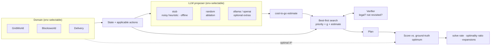

# PathwAI

[](https://pathwai.dexdevs.com)

> **▶ Live demo: [pathwai.dexdevs.com](https://pathwai.dexdevs.com)** — run it in your browser, free offline backend. Browse all 10 portfolio demos via the *all demos* link.

[](https://github.com/ranafaraz/PathwAI/actions/workflows/ci.yml)
[](pyproject.toml)
[](LICENSE)

**Wrap a fallible LLM in search and a verifier, and prove it plans like the optimum.**

PathwAI turns an LLM into a *deliberate planner*. A language-model proposer
estimates how far each state is from the goal; a best-first search uses that
estimate as a heuristic; and a verifier rejects illegal or looping moves so the
agent can recover from bad suggestions instead of executing them. Every plan is
scored against a built-in **A\* optimum**, so the claims are measured, not asserted.

It is **offline-first**: a deterministic *stub* proposer stands in for the LLM, so
the whole benchmark — three planning domains, five planners, an ablation — runs
green in CI with **no API keys and no model downloads**. Real proposers (Ollama,
OpenAI) are opt-in via pip extras and degrade gracefully back to the stub.

> The interesting question isn't "can an LLM plan?" — it's **"what does the LLM
> actually buy you?"** PathwAI separates the two effects: *search + verification*
> buys correctness, and *LLM guidance* buys efficiency. Remove either and you can
> watch exactly which one you lost.

## Demo

```console
$ pathwai compare --domain gridworld --seed 3
PathwAI :: gridworld (seed 3) :: backend=stub
optimal cost = 14.0
planner      solved  steps  opt.ratio  expansions
optimal         yes     14      1.000          36
uniform         yes     14      1.000          41
greedy          yes     14      1.000          16
llm             no       0          -            8   <- open-loop dead-ends
llm_search      yes     14      1.000          30   <- search+verifier recovers
```


## Architecture



## The result that matters

Pooled across **150 instances** (50 seeds × 3 domains), offline stub proposer,
every instance scored against its A\* optimum:

| Planner | Solve rate | Optimality ratio | Avg expansions |
|---|---:|---:|---:|
| optimal (A\*) — ground truth | 1.00 | 1.000 | 28.1 |
| uniform-cost (no heuristic) | 1.00 | 1.000 | 79.0 |
| greedy best-first | 1.00 | 1.045 | 15.0 |
| llm (open-loop, no backtrack) | 0.50 | 1.533 | 12.1 |
| **llm + search + verifier** | **1.00** | **1.012** | **25.5** |

Two effects, cleanly separated:

- **Search + verifier buys correctness.** The *same* noisy proposer the open-loop
  agent only solves 50% of instances with — at 1.53× the optimal plan length —
  solves **100%** at **1.01× optimal** once it can search and backtrack.
- **LLM guidance buys efficiency.** It reaches that optimum expanding **25.5**
  nodes vs. uninformed Dijkstra's **79.0** — a **3.1× search reduction** because the
  heuristic focuses the frontier.

### The null test (ablation)

Swap the stub for a *random* proposer that knows nothing, and the two effects
dissociate exactly as theory predicts:

| Planner (random guidance) | Solve rate | Avg expansions |
|---|---:|---:|
| llm (open-loop) | **0.17** | 11.6 |
| llm + search + verifier | 1.00 | **65.0** |

The open-loop agent **collapses** (0.17 solved); the search+verifier agent still
solves everything, but its expansions balloon from 25.5 → 65.0, drifting back
toward blind search. Correctness came from the verifier; efficiency came from the
guidance. (Full breakdown in [`evals/RESULTS.md`](evals/RESULTS.md).)

## Quickstart

```bash
python -m venv .venv && . .venv/bin/activate        # Windows: .venv\Scripts\activate
pip install -e ".[dev]"

pytest -q                    # 77 tests
python -m evals.harness      # full benchmark -> evals/RESULTS.md
python -m evals.gate         # CI quality gate (enforces the result's shape)

pathwai solve   --domain blocksworld --seed 2     # plan one instance
pathwai compare --domain delivery   --seed 1      # all five planners head-to-head
pathwai render  --domain gridworld  --seed 0      # view an instance
```

One-command Docker run (offline):

```bash
docker build -t pathwai . && docker run --rm pathwai
```

## Domains

| Domain | State | Optimal via | Admissible heuristic |
|---|---|---|---|
| **GridWorld** | agent cell | A\* / BFS | Manhattan distance |
| **Blocksworld** | normalised stacks | A\* / BFS | # misplaced blocks |
| **Delivery** | `(pos, pending, carried)` | A\* / BFS | remaining actions + longest travel chain |

Each domain ships a `render()` for the LLM prompt and the CLI, and an
**admissible** heuristic (unit-tested along every optimal path) — that admissibility
is what makes the A\* baseline a true optimum to measure against.

## Backend matrix

| Component | Offline default | Optional real backend | Env var |
|---|---|---|---|
| Proposer | `stub` (noisy heuristic) | `ollama` (`pathwai[ollama]`), `openai` (`pathwai[openai]`) | `PATHWAI_PROPOSER_BACKEND` |
| Planner | `llm_search` | — | `PATHWAI_PLANNER` |
| Domain | `gridworld` | — | `PATHWAI_DOMAIN` |

Optional backends are imported lazily and fall back to the stub if the server,
key, or dependency is missing — selecting one can never crash the pipeline.

## Why this is honest

- **The optimum is real.** Every ratio is divided by a provably optimal A\* plan,
  not by another heuristic's guess. Heuristic admissibility is unit-tested.
- **One search engine.** A\*, Dijkstra, greedy, and the LLM agent are the *same*
  best-first loop with different priority functions — the comparison can't be
  rigged by four subtly different implementations.
- **The stub is deliberately imperfect.** It is the true heuristic plus reproducible
  noise, so the open-loop agent honestly fails ~half the time. A perfect stub would
  make the whole point disappear; that gap is exactly what a stronger real LLM closes.

See [`docs/ARCHITECTURE.md`](docs/ARCHITECTURE.md) and
[`docs/DECISIONS.md`](docs/DECISIONS.md) for the design write-up.

## License

MIT — see [LICENSE](LICENSE).
