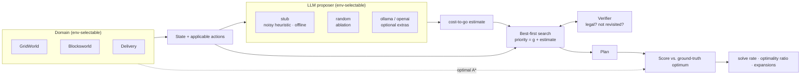

# PathwAI

[](https://github.com/ranafaraz/PathwAI/actions/workflows/ci.yml)
[](https://pathwai.dexdevs.com)
[](https://github.com/ranafaraz/PathwAI/blob/main/pyproject.toml)
[](https://github.com/ranafaraz/PathwAI/blob/main/LICENSE)

**Wrap a fallible LLM in search and a verifier, and prove it plans like the optimum.**

PathwAI turns an LLM into a deliberate planner. A language-model proposer estimates how far each state is from the goal; a best-first search uses that estimate as a heuristic; and a verifier rejects illegal or looping moves so the agent recovers from bad suggestions instead of executing them blindly. Every plan is scored against a built-in **A\* optimum**, so the claims are measured, not asserted.

The whole benchmark — three planning domains, five planners, a null ablation — runs green in CI with **no API keys and no model downloads** using a deterministic stub proposer. Real LLM backends (Ollama, OpenAI) are opt-in via pip extras.

## Architecture



## Quick start

```bash
python -m venv .venv && source .venv/bin/activate   # Windows: .venv\Scripts\activate
pip install -e ".[dev]"
pytest -q                    # 77 tests
pathwai compare --domain gridworld --seed 3
```

## Wiki pages

| Page | What it covers |
|---|---|
| [Architecture](Architecture) | Domain representation, proposer, verifier, search engine, ablation design |
| [Evaluation](Evaluation) | Benchmark setup, results table, ablation, reproduce commands |
| [Configuration](Configuration) | Env vars, backend matrix, `.env.example` |
| [Development](Development) | Setup, test commands, adding domains and proposers, code layout |
